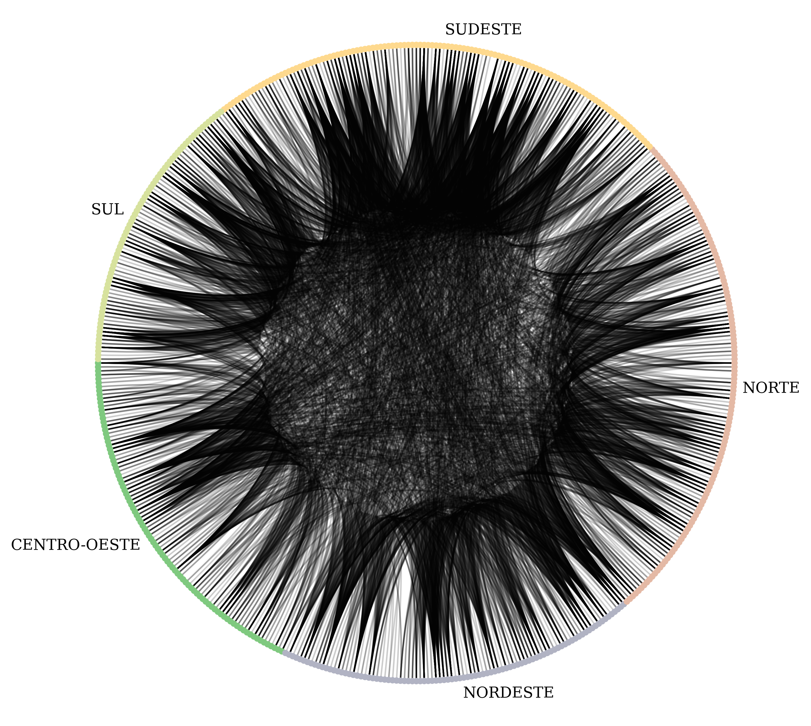
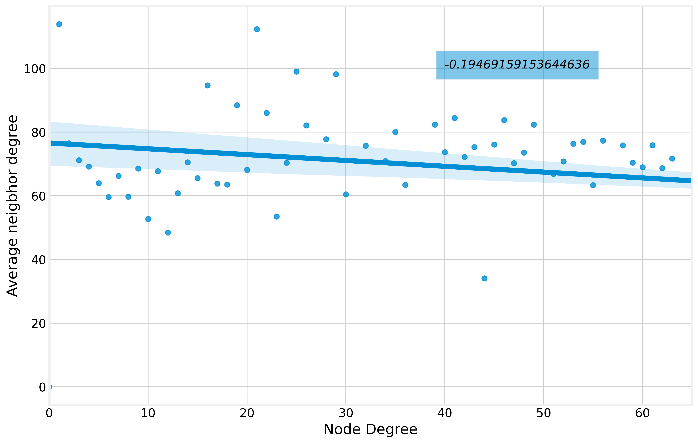
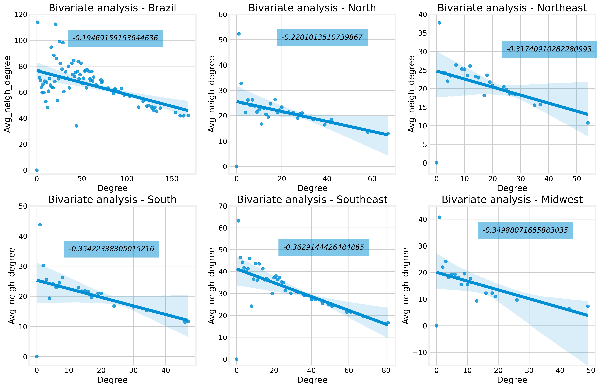
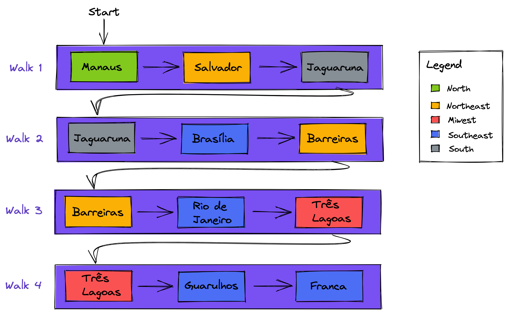

# Brazil Air Traffic Graph

This work consists of an analysis of the graph of all flights registered by ANAC (Agência Nacional de Aviação Civil - National Civil Aviation Agency) as part of the unit grade of the Algorithms and Data Structures II discipline at the Federal University of Rio Grande do Sul. Norte, taught by [Ivanovitch Silva](https://github.com/ivanovitchm). This work was done by me and the data was obtained from [Alvaro's Github](https://github.com/alvarofpp/dataset-flights-brazil) repository.

<p align='center'></p>

To reproduce just my steps, you can open the [notebook](/notebook.ipynb) in [Google Colab](https://colab.research.google.com/) and upload the [air_traffic_brazil.graphml](/air_traffic_brazil.graphml) file without running the first section of the notebook. But if you want to reproduce Alvaro's steps too, just run all sections of the notebook in Google Colab or create a virtual environment and install the [requirements.txt](dataset-flights-brazil/requirements.txt) file before running the notebook. Inside of [dataset-flights-brazil](/datasets-flights-brazil) you can find Alvaro's original README and his files to extract data and transform to graphml file.

For our purposes, I made a small modification to the `transform_to_graphml.py` file by adding the following line: `region=row['region']` to get the regions of Brazil for each node. The modification is shown explicitly below.

```python
# Add nodes
for index, row in df_airports.iterrows():
    G.add_node(row['code'],
               name=row['name'],
               country=row['country'],
               region=row['region'], # line added by Morsinaldo Medeiros
               latitude=row['lat_geo_point'],
               longitude=row['lon_geo_point']
               )
```

Once we have a graphml file with Brazil's region, we can load it using NetworkX with command below:

```python
# import packpage
import networkx as nx

# read graphml file
G_brazil = nx.read_graphml('air_traffic_brazil.graphml')
```

## ANALYSIS 1 - ASSORTATIVITY

For the first analysis, we'll take a look at assortativity, which is a metric to assess network homophily. In turn, homophily is a property that captures how much the nodes of a group relate to other groups. Thus, we generate the figure that you saw on the top of this README grouping by regions with the following code:

```python
# Create a Circos Plot
c = nv.CircosPlot(G_brazil,
                  node_color="region",
                  node_grouping="region",
                  node_order="region",
                  group_order="alphabetically",
                  group_legend=False,
                  node_labels=False,
                  group_label_position="middle",
                  group_label_color=False,figsize=(10,8))

# Draw c to the screen
c.draw()

# Display graph
plt.show()
```
In addition, we generate the mixing matrix, which correlates 

```python
# mixing matrix
nx.attribute_mixing_matrix(G_brazil,'region')
```

**Mixing Matrix**
 Region           |    Midwest    |     North      |      Northeast     |      South     | Southeast 
 :--------:| :--------: | :------:   | :--------: | :--------: | :--------:
1| **0.07358156** | 0.01340869 | 0.04022606 | 0.0120789  | 0.0070922
2| 0.01340869 | **0.0802305**  | 0.05474291 | 0.0106383  | 0.01983599
3| 0.04022606 | 0.05474291 | **0.17309397** | 0.03390957 | 0.02759309
4| 0.0120789  | 0.0106383  | 0.03390957 | **0.13453014** | 0.02293883
5| 0.0070922  | 0.01983599 | 0.02759309 | 0.02293883 | **0.05363475**


In the Mixing Matrix, we can see that North (NORTHEAST) and South-East (SOUTHEAST) are the regions with the highest percentage of connection with themselves. If you take a look at [IPEA (2009)](https://www.ipea.gov.br/presenca/index.php?option=com_content&view=article&id=26&Itemid=19), you will see that the North region has fewer highways than the other regions. So we can infer that airports there are more used for travel between some states or some cities. Thus, in other regions with more highways, road transport may be used more than air transport, causing the percentage of airport connections in these regions to be lower.

Next, we check the assortativity coefficient of the network with the following code:

```python
# assortativity coefficient
nx.attribute_assortativity_coefficient(G_brazil,"region")
```
Thus, the associative coefficient shows us that this network is assortative, that is, nodes of a group tend to interact with other nodes of the same group.

## ANALYSIS 2 - DEGREE VS N-NEIGHBORS

In the second analysis, we will see the relationship between the degree and the number of neighbors. In an assortative network, high-degree nodes tend to connect with other high-degree nodes. On the other hand, in a dissortative network, nodes with high degree tend to connect with nodes with low degree. To check this behavior, we can plot a graph with `Node Degree` vs `average neighbor degree` with the following code:

```python
# average degree of neighbors
degree, avg_neigh_degree = zip(*nx.average_degree_connectivity(G_brazil).items())

# convert to list
degree = list(degree)
avg_neigh_degree = list(avg_neigh_degree)

plt.style.use("fivethirtyeight")
fig, ax = plt.subplots(1,1,figsize=(12,8))

sns.regplot(degree,avg_neigh_degree,ax=ax)

ax.set_xlabel("Node Degree")
ax.set_ylabel("Average neigbhor degree")
ax.text(40, 100, str(nx.degree_assortativity_coefficient(G_brazil)), style='italic',
        bbox={'facecolor': '#008Fd5', 'alpha': 0.5, 'pad': 10})
ax.set_xlim(0,65)

plt.show()
```

This code generate the following figure:

<p align='center'></p>

The graph above shows that as the node degree increases, the neighbor's average degree decreases. This shows us that the network tends to be disassortative with respect to degree. We can see same graph by for regions:

<p align='center'></p>

As we can see in the image above, the regions of Brazil tend to follow the same behavior as the country: the networks of the regions tend to be disassortative in relation to the degree. So let's check the degree assortativity coefficient with the following code:

```python
nx.degree_assortativity_coefficient(G_brazil)
output:-0.19469159153644636
```

The coefficient above confirms that the network is disassortative in relation to degree as we saw in the graph. Thus, regions of Brazil with a high degree, such as the Southeast, for example, tend to connect with other regions of lower degree.

## ANALYSIS 3 - CONNECTED COMPONENTS

In the third analysis, we will see the connected components, which are subgraphs whose can be reached from one another by following the edges of the network. We can check if a graph is connected with following command:

```python
# is_connected is applied only to undirected graph
nx.is_connected(nx.Graph(G_brazil))
```

In our case, it is not connected, but we can check how many components are connected in G with the following command:

```python
# how many connected components has G?
nx.number_connected_components(G_brazil)
```
In our case, we have 6 connected components, so let's explore these components. To do this, we create a function to extract how many connected components there are for each region.

```python
def component_information(component):
  N = 0
  NE = 0
  CO = 0
  SE = 0
  S = 0
  for node in component:
    region = G_brazil.nodes[node]['region']
    if region == "NORTE":
      N += 1
    elif region == "NORDESTE":
      NE += 1
    elif region == "CENTRO-OESTE":
      CO += 1
    elif region == "SUDESTE":
      SE += 1
    else:
      S += 1 
    
  t = N + NE + CO + SE + S
  print("Quantidade de componentes connectados por região: \n")
  print(f"NORTE: {N} \nNORDESTE: {NE} \nCENTRO-OESTE: {CO} \nSUDESTE: {SE} \nSUL:{S}\n")
  print("Quantidade da porcentagem de componentes connectados por região: \n")
  print(f"NORTE: {N*100/t}% \nNORDESTE: {NE*100/t}% \nCENTRO-OESTE: {CO*100/t}% \nSUDESTE: {SE*100/t}% \nSUL:{S*100/t}% \n")
  print("--------------------------------")

# interact under all connected component of G_brazil
for component in nx.connected_components(G_brazil):
  component_information(component)
```

Given the above code output, we can see that there are some components with only one node. In the notebook, we explored these nodes and after a little research on the internet, these cities are relatively small (less than 100,000 inhabitants). Therefore, they may have a harder time connecting flights to other cities, due to their economies and sizes.

## ANALYSIS 4 - SHORTEST PATH

In the fourth analysis, we will see the shortest path, which is defined as the minimum number of links that must be traversed in a path connecting the two nodes. For this, we created a simulated scenario with some destinations (one for each region) and traced the route between these destinations looking for the shortest path. The scenario follows the itinerary below:

    1. North (NORTE) to South (SUL)
    2. South (SUL) to Northeast (NORDESTE)
    3. Northeast (NORDESTE) to Midwest (CENTRO-OESTE)
    4. Midwest (CENTRO-OESTE) to Southeast (SUDESTE)

We took some random destionations and store in a dictionary:
```python
destination = {
    'region_norte': 'SBEG',         # MANAUS
    'region_nordeste': 'SNBR',      # BARREIRAS
    'region_sul': 'SBJA',           # JAGUARUNA
    'region_sudeste': 'SIMK',       # FRANCA
    'region_centro_oeste': 'SBTG'   # TRÊS LAGOAS
}
```

To find the shortest path for each walk, you can use the following code:
```python
# North (NORTE) to South (SUL)
path1 = nx.shortest_path(G_brazil, destination['region_norte'], destination['region_sul'])
print(path1)
print(f"{G_brazil.nodes[path1[0]]['name']} -> {G_brazil.nodes[path1[1]]['name']} -> {G_brazil.nodes[path1[2]]['name']}")

# South (SUL) to Northeast (NORDESTE)
path2 = nx.shortest_path(G_brazil, destination['region_sul'], destination['region_nordeste'])
print(path2)
print(f"{G_brazil.nodes[path2[0]]['name']} -> {G_brazil.nodes[path2[1]]['name']} -> {G_brazil.nodes[path2[2]]['name']}")

# Northeast (NORDESTE) to Midwest (CENTRO-OESTE)
path3 = nx.shortest_path(G_brazil, destination['region_nordeste'], destination['region_centro_oeste'])
print(path3)
print(f"{G_brazil.nodes[path3[0]]['name']} -> {G_brazil.nodes[path3[1]]['name']} -> {G_brazil.nodes[path3[2]]['name']}")

# Midwest (CENTRO-OESTE) to Southeast (SUDESTE)
path4 = nx.shortest_path(G_brazil, destination['region_centro_oeste'], destination['region_sudeste'])
print(path4)
print(f"{G_brazil.nodes[path4[0]]['name']} -> {G_brazil.nodes[path4[1]]['name']} -> {G_brazil.nodes[path4[2]]['name']}")
```

The outputs of the code above can be checked in the image below:
<p align='center'></p>

Thus, in each walk, 2 paths were performed, totaling 8 paths.

## ANALYSIS 5 - CLUSTERING COEFFICIENT

In the fifth analysis, we will look at the clustering coefficient, which is the fraction of possible clovers that contain the ego. This analysis will be done for the total graph and subgraphs by region. You can check how many triangles each graph has wih the following code: 

```python
# checking triangles
nx.triangles(G_brazil)
```

To check the clutering coefficient:
```python
# clustering cofficient
nx.clustering(G_brazil)
```

You can checj yet the average of clusteginf coefficient:
```python
# average clustering coefficient
nx.average_clustering(G_brazil)
```

Below, we can see the results for the average clustering coefficient by region.

    - North (NORTE): 0.6134444520831852
    - Northeast (NORDESTE): 0.47198771887877156
    - Midwest (CENTRO-OESTE): 0.5590942785192811
    - Southeast (SUDESTE): 0.605227147311124
    - South (SUL): 0.59697513016503

As we can see above, the region with the highest average clustering is the North, followed by the Southeast and South, respectively. In addition, the region with the lowest average clustering is the northeast followed by the midwest.

## References

- Avaro's Github[](https://github.com/alvarofpp/dataset-flights-brazil)

- Ivanovitch's Repo[](https://github.com/ivanovitchm/datastructure)

- NetworkX [](https://github.com/networkx/networkx)