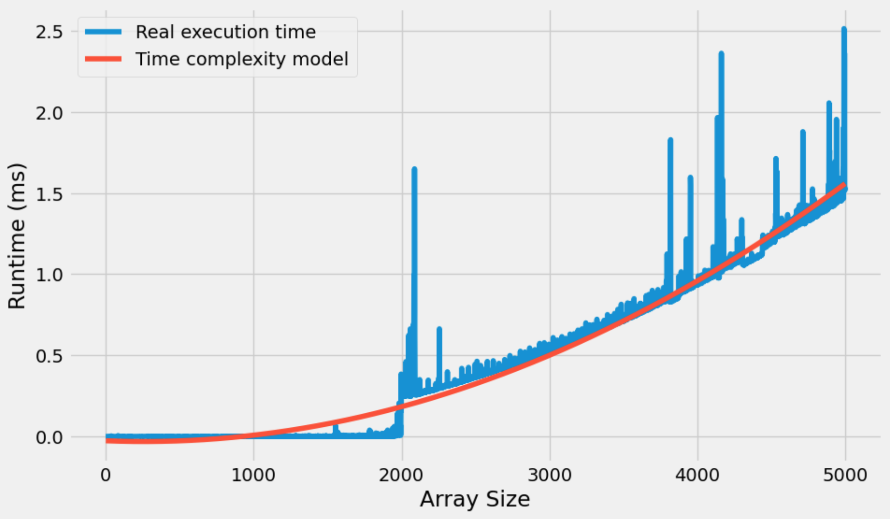
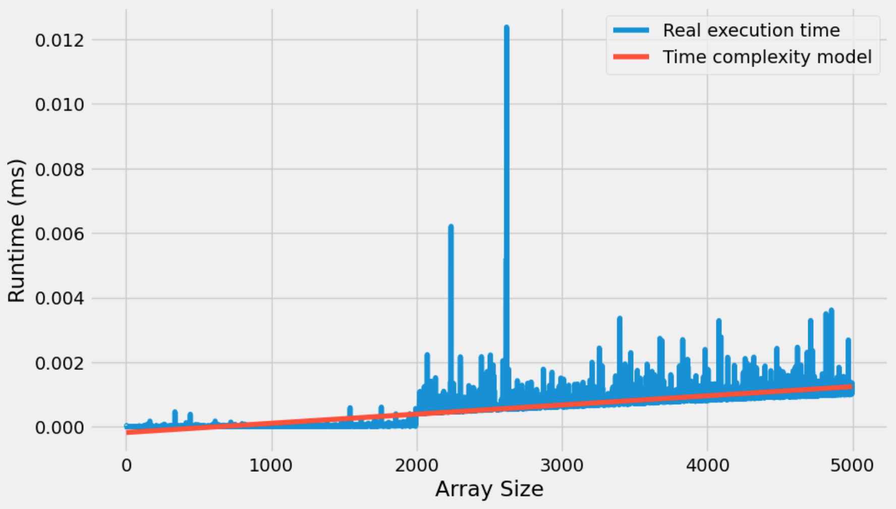

# Two Number Sum

Write a function that take in a non-empty array of distinct integers and an integer representing a target sum. If any two numbers in the input array sum up to the target sum, the function should return then in an array, in any order. If no two numbers sum up to the target sum, the function should return an empty array.

You can check the notebook with complete solution: [](https://github.com/Morsinaldo/data_structure_II/blob/main/job_interview_troubleshooting/two_number_sum/Two_Number_Sum.ipynb)

## Solution O(n^2)
Note that in function code below we have two for loops as we are fixing a number in the vector and checking if the sum of this with another number in the vector matches the desired target. So, in the worst case, we will take a time proportional to the size of the vector squared to find the solution (or not to find it).

```python 
def twoNumberSum(array, targetSum):
  """
  Description:
  A function that take in a non-empty array of distinct integers
  and an integer representing a target sum. If any two numbers 
  in the input array sum up to the target sum, the function should
  return then in an array, in any order. 
  If no two numbers sum up to the target sum, 
  the function should return an empty array.

  Parameters:
  array <list>: list of integers
  targetSum <integer>: integer representing a target sum

  Return:
  Interger pair which sum is equal to targetSum
  empty otherwise
  """
  for i in range(len(array) - 1):
    firstNum = array[i]
    for j in range (i+1, len(array)):
      secondNum = array[j]
      if firstNum + secondNum == targetSum:
        return [firstNum, secondNum]
  return []
```
For teaching purposes, I've made a loop that increases a vector from 1 to 5000 positions while looking for the two values whose sum is equal to the size of the vector. The image below shows the graph of the times spent in the operation for its respective vector size.

<center></center>

As we can see, the curve follows a quadratic growth trend with increasing vector size.

## Solution O(n)

Note that in the function code below we only have one for loop. Then, we run through the vector once, storing the subtraction of the verified number from the target sum in a dictionary. When the algorithm finds a value of y that is already stored in the dictionary, we will have found the pair of numbers we were looking for.

```python
def twoNumberSum(array, targetSum):
  """
  Description:
  A function that take in a non-empty array of distinct integers
  and an integer representing a target sum. If any two numbers 
  in the input array sum up to the target sum, the function should
  return then in an array, in any order. 
  If no two numbers sum up to the target sum, 
  the function should return an empty array.

  Parameters:
  array <list>: list of integers
  targetSum <integer>: integer representing a target sum

  Return:
  Interger pair which sum is equal to targetSum
  empty otherwise
  """
  dictionary = {}
  for i in range(len(array)):
    x = array[i]
    y = targetSum - x
    if y not in dictionary:
      dictionary[x] = True
    else:
      return [y,x]
  return []
```

The image below shows the graph of the same experiment performed earlier for the function with time complexity O(n).

<center></center>

As we can see, the curve follows a linear growth trend with increasing vector size. Comparing the two images, it is possible to notice a big difference in relation to the y axis, that is, the time axis. So to highlight this difference, the following image shows the two curves plotted on the same graph.

<center></center>